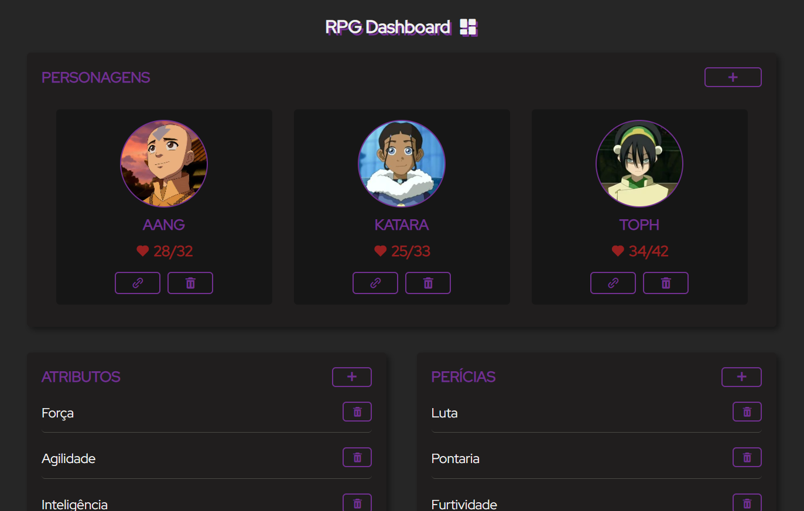

## RPG Dashboard 
É uma aplicação web de um Dashboard de mestre de RPG personalizável. 

No Dashboard é possível criar e gerenciar personagens, além de personalizar os atributos e perícias que estarão presentes em cada personagem. Também é possível fazer anotações e jogar diferentes tipos de dados (D6, D20, etc).

Para cada personagem, é possível acessar sua ficha. Nela, é possível visualizar e modificar todas as informações do personagem, como os valores dos atributos, a descrição, imagem, vida máxima e atual, adicionar ataques e habilidades do personagem, itens de inventário, entre várias outras coisas. 

A ideia do Dashboard é ser simples e flexível para poder ser utilizado em diferentes sistemas de RPG, considerando a personalização dos atributos e perícias, além de uma ficha de personagem genérica, porém bastante completa, com informações presentes em vários sistemas. Além disso, todos os dados são salvos de forma local para um uso mais fácil.



### Tecnologias
<div style="display: flex; gap: 5px;">
    
    
    
</div>

### Execução
Para acessar o projeto basta acessar o link [🔗RPG Dashboard](https://gabriel-piva.github.io/rpg-dashboard/) gerado com o [Github Pages](https://pages.github.com/) ou clonar o repositório e abrir o arquivo `index.html` em algum servidor web.
```bash
git clone https://github.com/gabriel-piva/rpg-dashboard.git
```

### Objetivo
O projeto tinha como objetivo principal o estudo e prática de HTML, CSS e JavaScript, focando na construção de uma aplicação responsiva e em como os personagens e seus aspectos são salvos e atualizados usando Local Storage, enquanto estão integrados entre si pela estrutura de classes.

### Referências
O ícone da página vem do [Flaticon](https://www.flaticon.com/free-icon/swords_8530442), a fonte utilizada vem do [Google Fonts](https://fonts.google.com/specimen/Red+Hat+Display) e a biblioteca de ícones é a [Boxicons](https://boxicons.com/).